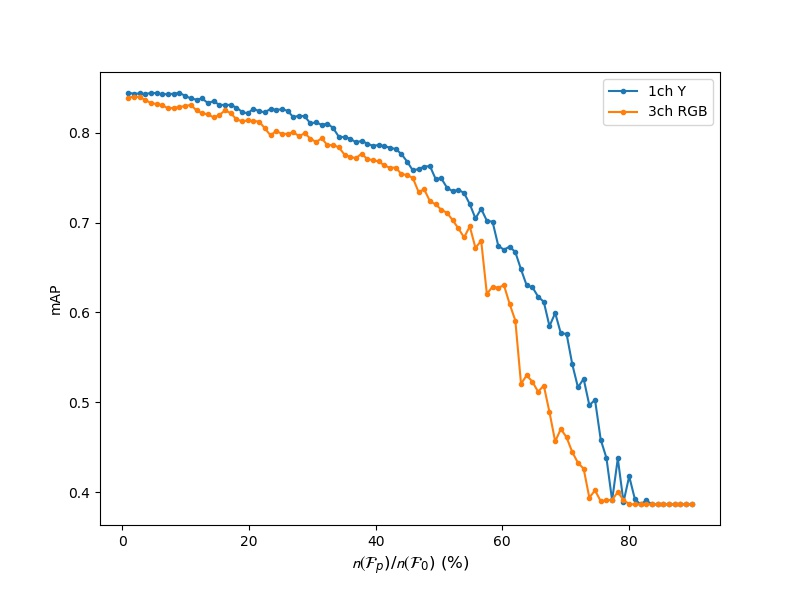

# Filter pruning by image channel reduction in pre-trained convolutional neural networks

---

Official Pytorch implementation of filter pruning by gray conversion | [Paper](https://link.springer.com/article/10.1007/s11042-020-09373-9) 

Our implementation is based on these repositories:

- [Official PyTorch transfer-learning Tutorials](https://pytorch.org/tutorials/beginner/transfer_learning_tutorial.html)
- [pytorch-pruning](https://github.com/jacobgil/pytorch-pruning)

## Abstract

---

There are domain-specific image classification problems such as facial emotion and house-number classifications, where the color information in the images may not be crucial for recognition. This motivates us to convert RGB images to gray-scale ones with a single Y channel to be fed into the pre-trained convolutional neural networks (CNN). Now, since the existing CNN models are pre-trained by three-channel color images, one can expect that some trained filters are more sensitive to colors than brightness. Therefore, adopting the single-channel gray-scale images as inputs, we can prune out some of the convolutional filters in the first layer of the pre-trained CNN. This first-layer pruning greatly facilitates the filter compression of the subsequent convolutional layers. Now, the pre-trained CNN with the compressed filters is fine-tuned with the single-channel images for a domain-specific dataset. Experimental results on the facial emotion and Street View House Numbers (SVHN) datasets show that we can achieve a significant compression of the pre-trained CNN filters by the proposed method. For example, compared with the fine-tuned VGG-16 model by color images, we can save 10.538 GFLOPs computations, while keeping the classification accuracy around 84% for the facial emotion RAF-DB dataset.

### Graph of accuracy drop when implementing filter pruning(using RAF-DB) compare RGB model to Gray model(without fine-tuning)



## Getting Started

---

### Requirements

- Python3
- PyTorch >1.0
- torchvision >0.2
- Numpy
- THOP

### Train examples

- SVHN, VGG-16, 1Ch Y (first-layer pruning and then fine-tuning)

```jsx
python first_layer_pruning_finetuning.py \
--data_dir C:/dataset/SVHN \
--model vgg-16 \
--save_dir models \
--save_model VGG_SVHN_Y \
--init_lr 0.01 \
--batch_size 64 \
--num_classes 10 \
--num_epoch 30
```

### Test examples

- RAF-DB, ResNet-101, 3Ch RGB (first-layer pruned and fine-tuned)

```jsx
python test.py \
--data_dir C:/dataset/RAFDB/test \
--rgb \
--save_dir models \
--model_dir models/RAF/RGB/resnet.pth \
--batch_size 64 \
```

### Pruning examples

- (command line argument will be added soon. )
- RAF-DB, VGG-16, 1Ch Y (preliminary first-layer pruned and fine-tuned)

```jsx
python pruning.py
```

### Calculation of GFLOPs

- GFLOPs and processing time can be easily calculated from  `cal_GFLOPs.ipynb`. When you measure the all-layer pruned VGG model, you have to define the pruned model's filter layout. 

